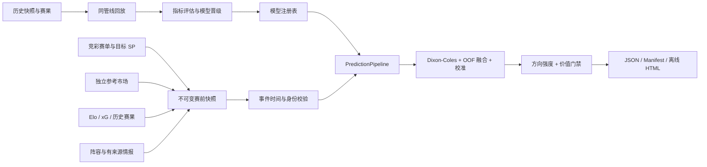

# football-prediction-skill

[](https://github.com/JetQiao/football-prediction-skill/actions/workflows/ci.yml)
[](https://github.com/JetQiao/football-prediction-skill/releases)
[](https://www.python.org/)
[](https://nodejs.org/)
[](LICENSE)

面向 Codex、Claude Code 与命令行的竞彩足球概率研究 Skill。它把竞彩赛单、球队特征、独立参考市场、目标竞彩价格、阵容事实、模型版本和历史回放放进同一条事件时间管线，最终生成可追溯、可离线打开的深色 HTML 研究报告。

> 只做赛前概率研究与回测，不代客操作、不提供下注通道、不承诺命中率或收益。理性购彩，未成年人禁止购彩。

## 为什么是 v0.5.1

v0.5.1 的重点不是把界面包装得更像“预测神器”，而是让每个概率都能回答四个问题：

1. 这条数据在预测截点时是否已经可用？
2. 概率是否独立于正在比较的竞彩价格？
3. 模型是否通过样本外校准和晋级门槛？
4. 方向判断和价格价值是否被分开表达？

因此，本版本完成了以下重构：

- 日常预测与历史回放共用同一个 `PredictionPipeline`。
- DuckDB 管理快照目录，Parquet/JSON 保存不可变赛前数据。
- `reference_market / target_market / benchmark_market` 角色强隔离。
- Dixon-Coles、去水方法、融合器和温度校准进入本地模型注册表。
- 只有样本外 Brier、Log-loss、RPS 与 ECE 通过门槛的模型才能晋级。
- 方向输出 `strong / moderate / slight / unavailable`，价值输出 `candidate / watch / no_edge / unverified / unavailable`。
- 缺少独立价值证据时保留概率方向，并明确标记“未独立验证”；只有概率输入不可用时才停止输出方向。
- 报告重构为高密度概率与价格工作台，桌面端使用赛单表和详情抽屉，移动端使用紧凑比赛卡。

## 60 秒开始

需要 Node.js 18+ 和 Python 3.10+。

安装 Skill 与独立运行环境：

```bash
npx -y github:JetQiao/football-prediction-skill install
```

安装完成后先运行离线演示：

```bash
football-predict daily \
  --date today \
  --demo \
  --no-open \
  --out ./reports/demo
```

生成真实日期的竞彩报告：

```bash
football-predict daily --date today
```

未注册全局命令时，可以直接使用：

```bash
npx -y github:JetQiao/football-prediction-skill \
  daily --date today
```

在 Codex 或 Claude Code 中也可以直接说：

```text
使用 football-prediction-skill 按严格赛前截点分析今天的竞彩足球，
区分参考市场与目标竞彩，生成完整 HTML 报告。
```

## 核心能力

- 完整保留官方赛单：HAD 未开售、仅 HHAD 在售或玩法暂未开放都不会漏场。
- 动态 Dixon-Coles、Elo/xG、Power/Shin 去水、样本外融合与概率校准。
- 自动尝试 ClubElo；可选接入 The Odds API 和 API-Football。
- 结构化阵容事实映射为有界 xG 调整，不让智能体直接填写胜平负影响。
- 统一生成胜平负、公平赔率、比分矩阵、让球、总进球和半全场推演。
- Brier、Log-loss、RPS、ECE、校准斜率、ROI、覆盖率和最大回撤评估。
- 小组赛蒙特卡洛排名与赛事推演。
- 自包含 HTML：CSS、JavaScript、SVG 与数据全部内联，离线打开不发网络请求。

## 双轨结论

每场比赛分别回答两个问题：概率更偏向哪个赛果，以及当前竞彩价格是否存在经过独立验证的价值。二者不再被压缩成一个“推荐/弃权”标签。

方向状态：

| 状态 | 含义 |
|---|---|
| `strong` | 最高概率至少 50%，且领先第二结果至少 18 个百分点 |
| `moderate` | 最高概率至少 40%，且领先第二结果至少 8 个百分点 |
| `slight` | 有有效概率分布，但结果差距较小 |
| `unavailable` | 缺少统计模型、参考市场和完整官方玩法，无法形成有效方向 |

价值状态：

| 状态 | 含义 |
|---|---|
| `candidate` | 独立概率、校准状态和价格优势全部通过门槛 |
| `watch` | 存在正向价格差，但校准或优势强度尚未达到候选门槛 |
| `no_edge` | 目标竞彩价格没有正向独立优势 |
| `unverified` | 方向可用，但缺少独立概率，或目标价格参与了概率形成 |
| `unavailable` | 目标竞彩胜平负尚无可比较价格 |

“未独立验证”不等于“整场弃权”。它表示可以研究方向，但不能据此宣称存在价格价值。

## 事件时间与市场隔离

进入模型的赛前数据必须满足：

```text
observed_at <= as_of < kickoff_at
model.trained_until < business_date
```

三类市场的职责严格分离：

| 市场角色 | 用途 | 示例 |
|---|---|---|
| `reference_market` | 预测先验或融合输入 | Pinnacle、可靠多公司共识 |
| `target_market` | 价值比较对象 | 竞彩 HAD/HHAD SP |
| `benchmark_market` | 历史概率评估或 CLV | 同截点市场、收盘市场 |

目标竞彩价格一旦参与概率形成，同一场比赛会自动禁止独立价值候选。

## 架构



详细模块边界见 [架构文档](docs/architecture.md)，公共输入协议见 [数据契约](docs/data-contracts.md)。

## 推荐每日工作流

```bash
# 1. 获取赛单、生成情报队列并写入不可变快照
football-predict sync \
  --date today \
  --as-of now \
  --out ./work/today

# 2. 对 A 级场补充有来源的结构化 facts[]
football-predict validate-intel ./work/today/intel.json

# 3. 在同一预测截点生成报告
football-predict daily \
  --date today \
  --as-of now \
  --input ./work/today/matches_YYYY-MM-DD.json \
  --intel ./work/today/intel.json
```

历史日期没有显式提供 `--as-of` 时，系统会使用最早比赛前 90 分钟作为安全截点。截点前已经开赛的比赛只保留原始快照，不生成伪赛前预测。

## 模型生命周期

训练 challenger：

```bash
football-predict train ./E0.csv \
  --competition 英超 \
  --alias "Premier League"
```

查看模型注册表：

```bash
football-predict models
```

通过门槛后晋级：

```bash
football-predict train ./E0.csv \
  --competition 英超 \
  --promote
```

未通过样本外门槛时，命令会拒绝晋级。`--force-promote` 只用于明确的研究实验，不应作为生产默认设置。

## 回测与当前结果

生产概率回放：

```bash
football-predict backtest ./E0.csv \
  --pipeline production \
  --no-open
```

独立价值策略回放：

```bash
football-predict backtest ./E0.csv \
  --pipeline independent-value \
  --no-open
```

批量运行多联赛赛季：

```bash
python scripts/run-benchmark.py /path/to/csv-directory \
  --pipeline production \
  --out /tmp/football-benchmark.json
```

v0.5 使用 2023/24、2024/25、2025/26 五大联赛 15 组 CSV 完成首轮回放：

| 管线 | 样本 | Brier | Log-loss | RPS | ECE | 候选 |
|---|---:|---:|---:|---:|---:|---:|
| v0.5 production | 3,436 | 0.1950 | 0.9818 | 0.1968 | 0.0582 | 0 |
| v0.5 independent-value | 3,436 | 0.2002 | 1.0053 | 0.2046 | 0.0564 | 0 |
| 市场基线 | 3,436 | 0.1923 | 0.9696 | 0.1942 | — | — |

相比 v0.4 审计的 Brier `0.2001`、Log-loss `1.0057`，生产管线已有改善，但目前仍未稳定击败市场基线。因此系统不会制造候选下注，也不会把“比旧版好”描述成“已经存在稳定超额”。

审计和设计记录：

- [v0.5 基线审计](docs/v0.5-baseline-audit.md)
- [v0.5 准确度架构](docs/v0.5-accuracy-architecture.md)
- [v0.5 报告设计与验收](docs/v0.5-report-design.md)

## 可选数据源

| 环境变量 | 用途 |
|---|---|
| `SPORTTERY_API_URL` | 本地或自部署 SportteryAPI |
| `SPORTTERY_API_KEY` | SportteryAPI 可选鉴权 |
| `THE_ODDS_API_KEY` | 独立参考市场 |
| `API_FOOTBALL_KEY` | 结构化伤病；赛单需要提供 `provider_fixture_id` |
| `FOOTBALL_AUTO_CLUBELO` | 无本地特征时自动尝试 ClubElo，默认 `true` |

没有配置付费数据源也可以运行。报告会明确标记数据降级：保留可用的概率方向，同时把无法独立证明的价格价值标记为“未独立验证”。

## CLI 索引

| 命令 | 用途 |
|---|---|
| `doctor [--strict]` | 检查依赖、数据源和生产模型 |
| `sync / prepare` | 获取赛单、生成情报队列并写入快照 |
| `daily` | 生成每日预测 JSON、manifest 与 HTML |
| `validate-intel` | 校验来源、时间和重复阵容事实 |
| `fetch-features` | 生成 ClubElo/xG 特征快照 |
| `train` | 训练 Dixon-Coles、融合器和校准器 |
| `models` | 查看或晋级模型注册表 |
| `snapshots` | 查看本地不可变快照目录 |
| `backtest` | 使用生产管线做滚动历史回放 |
| `evaluate-daily` | 用赛后比分评估已保存预测 |
| `tournament` | 运行小组赛蒙特卡洛模拟 |

运行 `football-predict <command> --help` 查看完整参数。

## 产物

每日运行会生成：

- `prediction_YYYY-MM-DD.json`：机器可读预测、方向状态与价值状态。
- `report_YYYY-MM-DD.html`：自包含离线研究报告。
- `manifest_<run_id>.json`：截点、快照、模型、参数、警告和产物路径。
- DuckDB 目录与 Parquet/JSON 快照：不可变赛前数据。

`run_id` 由预测截点、快照 ID、模型版本和关键参数确定；相同输入会得到相同运行标识。

## 从源码开发

```bash
python3 -m venv .venv
. .venv/bin/activate
pip install -e '.[dev]'

python -m unittest discover -s tests -p 'test_*.py'
ruff check src tests scripts
node scripts/validate-report.mjs /path/to/report.html
python /path/to/skill-creator/scripts/quick_validate.py \
  skill/football-prediction-skill
```

发布记录见 [CHANGELOG](CHANGELOG.md)。Issue 和 Pull Request 欢迎提交。

## 支持项目

如果这个项目帮你节省了研究或开发时间，欢迎请作者喝杯咖啡 ☕️。你的支持会用于持续维护数据管线、模型验证和报告体验。

<p align="center">
  
</p>

<p align="center"><sub>感谢支持，量力而行。</sub></p>

## License

MIT。第三方数据与服务受各自条款约束，详见 [NOTICE](NOTICE)。
