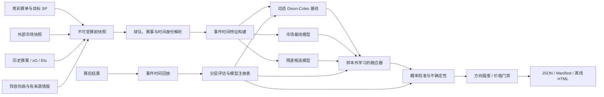

# v0.5 预测准确度目标架构

> 状态：已实施并完成首轮基准验证。
> 本文是 v0.5 的目标架构与落地记录；实际公共契约以 `docs/architecture.md` 和 `docs/data-contracts.md` 为准。

## 1. 架构目标

v0.5 的核心目标不是承诺“提高命中率”，而是建立一套可以持续证明是否变准的系统：

- 日常预测和历史回测使用完全相同的代码路径。
- 所有数据都遵守事件时间，杜绝未来数据泄漏。
- 独立模型、参考市场和目标竞彩价格职责分离。
- 模型融合权重、校准器和置信度由样本外数据学习。
- 数据不足时明确降级：保留可用的概率方向，缺少独立证据时停止价值结论，不用专业化 UI 掩盖输入缺失。
- 每次预测都能追溯到数据快照、模型版本和校准版本。

## 2. 总体数据流



## 3. 数据角色必须显式化

### 3.1 三类市场

每个市场输入必须声明角色：

| 角色 | 用途 | 示例 |
|---|---|---|
| `reference_market` | 作为预测先验或融合输入 | Pinnacle、可靠多公司共识 |
| `target_market` | 用于价值比较 | 竞彩 HAD/HHAD SP |
| `benchmark_market` | 只用于赛后评估 | 同截点市场、收盘市场 |

硬性约束：

- `target_market` 不能同时作为同一玩法价值信号的唯一预测来源。
- 只有竞彩多玩法时，可输出“竞彩市场共识”，不得输出独立价值。
- 收盘赔率只能用于收盘基准或 CLV，不得注入更早预测截点。

### 3.2 统一时间字段

所有快照至少包含：

- `fixture_id`
- `business_date`
- `kickoff_at`
- `as_of`
- `observed_at`
- `source`
- `source_event_id`
- `schema_version`
- `payload_hash`

模型只允许读取 `observed_at <= as_of < kickoff_at` 的数据。

## 4. 快照与存储

已采用：

- DuckDB：快照目录、特征、预测、赛果、模型评估的本地分析仓库。
- Parquet：按 `dataset/season/date/as_of` 分区保存不可变历史数据。
- JSON：继续作为 Skill 对外输入输出协议和可读快照。

原因：

- DuckDB 与 Parquet 都是成熟开源方案，适合本地批量回放和分层分析。
- 无需常驻数据库服务。
- 能直接查询 CSV/JSON/Parquet，便于复用 football-data.co.uk 数据。
- 最终 HTML 仍保持单文件、离线和零运行时依赖。

实现模块：

```text
src/football_prediction/
├── snapshots/          # 不可变快照、as_of 过滤、数据目录
├── identity/           # 球队/赛事/赛季/比赛统一 ID
├── features/           # 事件时间特征构建
├── modeling/
│   ├── goals/          # Dixon-Coles / 进球分布
│   ├── market/         # 去水与市场基线
│   ├── ensemble/       # 样本外融合
│   ├── calibration/    # 概率校准
│   ├── uncertainty/    # 不确定性与 OOD
│   └── registry/       # 模型版本和晋级状态
├── intelligence/       # 事实抽取、去重和阵容事件
├── policy/             # 方向强度、价值和风险规则
├── evaluation/         # 生产管线回放与指标
├── pipeline/           # prepare/enrich/predict/evaluate 编排
└── reporting/          # 视图模型与离线报告
```

## 5. 球队与比赛身份

当前按名称规范化匹配不足以支撑自动化生产。

v0.5 引入稳定 ID：

- `competition_id`
- `season_id`
- `team_id`
- `fixture_id`
- `provider_team_id`
- `provider_fixture_id`

名称解析策略：

1. 优先 Provider 原始 ID 映射。
2. 使用人工维护 alias 表。
3. 名称、日期、主客队联合匹配。
4. 无法唯一确定时停止增强，不做模糊猜测。

## 6. 特征体系

### 6.1 必选基础特征

- 动态攻击/防守强度。
- 主客场拆分。
- 时间衰减。
- 联赛平均进球和主场优势。
- Elo/Glicko 强度与变化。
- 最近 xG/xGA，按对手强度修正。
- 休息天数、连续客场、赛程密度。
- 球队样本量和升降级冷启动状态。
- 预测截点与开赛时间距离。

### 6.2 可选增强特征

- 预计首发和确认首发。
- 伤停球员的预计分钟与位置影响。
- 门将、中卫、后腰、中锋等关键位置缺失。
- 赔率开盘到当前的方向、幅度和跨公司分歧。
- 天气、场地和旅行距离。

### 6.3 缺失值与不确定性

- 不用固定中性值伪装成已知数据。
- 对小样本球队向联赛先验收缩。
- 每组特征输出 `coverage`、`freshness` 和 `uncertainty`。
- 特征缺失可以降低模型权重；若仍有可靠市场概率则保留方向，只有全部有效输入缺失时才停止方向输出。

## 7. 模型层

### 7.1 Champion：动态 Dixon-Coles

保留 Dixon-Coles 作为可解释基础模型，但需要：

- 按联赛/赛事独立或分层拟合。
- 模型在日常预测时自动从注册表加载。
- 同一比赛日整体留出，避免同日泄漏。
- 衰减、正则、主场优势和 `rho` 通过滚动验证选择。
- 对新队、升班马和跨赛事球队使用分层先验。

### 7.2 Market Baseline

市场去水不再只使用简单比例归一化，至少比较：

- Multiplicative normalization。
- Power method。
- Shin method。

去水方法按历史校准表现选择，并记录市场返还率和数据新鲜度。

### 7.3 Challenger：残差模型

不直接假设复杂 ML 一定更准，而是作为 challenger：

- 首选成熟开源 CatBoost 或同等级梯度提升方案。
- 学习“统计模型/参考市场仍未解释的残差”。
- 输入只使用预测截点可获得的结构化特征。
- 使用滚动 OOF 预测训练融合器，禁止训练内概率进入评估。
- 只有通过晋级门槛才进入生产。

### 7.4 融合器

替换固定 `market_weight`：

- 输入为各子模型的 log probability、数据覆盖和市场新鲜度。
- 使用带正则的多项逻辑融合或 Dirichlet stacking。
- 按联赛族、国家队/俱乐部、预测截点分层。
- 样本不足时退回全局权重。
- 权重产物包含 `trained_until`、样本量和 OOF 指标。

### 7.5 概率校准

候选方法：

- Temperature scaling。
- Vector scaling。
- Dirichlet calibration。
- 大样本分层下的 isotonic calibration。

校准器必须：

- 只用预测时点之前的 OOF 概率训练。
- 进入模型注册表。
- 在报告中展示版本、训练截止时间和分层样本量。

## 8. 情报层重构

智能体只负责把非结构化内容抽取为事实，不直接填写胜平负 `impact`。

首选事实协议：

```json
{
  "event_type": "player_unavailable",
  "team_id": "team-123",
  "player_id": "player-456",
  "status": "confirmed",
  "expected_minutes_delta": -75,
  "position": "ST",
  "source_url": "https://example.com/news",
  "published_at": "2026-07-16T10:00:00+08:00",
  "credibility": 0.95,
  "event_fingerprint": "sha256:..."
}
```

确定性特征层再把事实映射为：

- 阵容强度变化。
- 进攻/防守 xG 调整。
- 不确定性变化。

同一事件按 fingerprint 去重；传闻必须满足多源确认规则。

## 9. 统一生产与回测管线

目标接口：

```text
PredictionPipeline.predict(context: PredictionContext) -> PredictionResult
ReplayEngine.run(snapshot_range, model_version, policy_version) -> EvaluationBundle
```

生产和回测都调用同一个 `PredictionPipeline`，区别只在 Provider：

- 生产：读取当前 `as_of` 快照。
- 回测：读取历史 `as_of` 快照。

禁止维护第二套“简化回测模型”。

## 10. 指标与模型晋级

### 10.1 概率指标

- Multiclass Brier。
- Log-loss。
- Ranked Probability Score。
- ECE / ACE。
- Calibration slope / intercept。
- 按主胜/平/客、联赛、赔率区间和数据模式分层。

### 10.2 策略指标

- ROI / Yield。
- 最大回撤百分比。
- CLV。
- 下注数量与覆盖率。
- 不同阈值的稳定性。
- Bootstrap 95% 置信区间。

### 10.3 晋级规则

建议第一阶段门槛：

1. 聚合 Log-loss 不劣于同截点参考市场 `0.2%` 以上。
2. 聚合 Brier 至少改善 `0.5%`，或在预先声明的目标分层稳定改善。
3. ECE 不高于 `0.03`。
4. 任何大样本联赛分层不得恶化超过 `2%`。
5. 价值信号必须具备独立参考市场，且 CLV 或样本外 Edge 的置信区间为正。
6. 未通过门槛的 challenger 不进入生产，不因单段 ROI 漂亮而破例。

## 11. 置信度、方向与价值

新的置信度由以下因素共同决定：

- 校准后概率的历史可靠性。
- 预测熵。
- 子模型分歧。
- 数据覆盖和新鲜度。
- 训练分布外程度。
- 对应分层的历史样本量。

置信度正式输出：

- `high`：校准可靠且数据完整。
- `medium`：可输出概率，但优势或数据一般。
- `low`：仅作信息展示。

方向状态独立输出：

- `strong`：最高概率至少 50%，且领先第二结果至少 18 个百分点。
- `moderate`：最高概率至少 40%，且领先第二结果至少 8 个百分点。
- `slight`：有有效概率，但三个结果相对接近。
- `unavailable`：只有中性占位先验，无法形成有效方向。

价值状态独立输出：

- `candidate`：独立概率、校准和价格优势全部通过。
- `watch`：存在正向价格差，但尚未通过完整门槛。
- `no_edge`：没有正向独立优势。
- `unverified`：方向可用，但价值缺少独立验证。
- `unavailable`：目标价格不可比较。

“无优势/价值未验证”必须成为正式结果，但不得覆盖已有的概率方向。

## 12. CLI 实现

已新增或调整：

```text
football-predict sync --date YYYY-MM-DD --as-of T-90m
football-predict train --until YYYY-MM-DD --competitions ...
football-predict predict --date YYYY-MM-DD --as-of T-90m
football-predict backtest --from ... --to ... --as-of T-90m --pipeline production
football-predict evaluate --auto
football-predict model list
football-predict model promote <version>
football-predict doctor --strict
```

`daily` 继续作为一键入口，但内部执行：

```text
赛单快照 → 自动增强 → 身份校验 → 模型加载 → 预测 → 报告 → manifest
```

## 13. 实施状态

### Phase 0：测量基础（完成）

- 快照协议和 `as_of`。
- 生产管线回放。
- 修复同日泄漏。
- 统一价值策略。
- 新增完整评估指标。

### Phase 1：模型与注册表（完成）

- 动态 Dixon-Coles 自动加载。
- 去水方法比较。
- OOF 融合与校准。
- 置信度、方向强度和价值门禁。

### Phase 2：数据增强自动化（完成首版）

- 外部市场自动 Provider。
- Elo/xG 自动快照。
- API-Football 阵容伤病接入。
- 情报事实协议与去重。

### Phase 3：报告重构（完成）

- 新报告视图模型。
- 高密度赛单工作台。
- 单场分析抽屉。
- 新回测与校准面板。

### Phase 4：验证与发布（完成代码、静态 UI、基准与打包验证）

- 三赛季五联赛基准。
- 泄漏、校准和模型注册测试。
- 桌面/移动端视觉验收。
- 安装器、Wheel、npm tarball 冷启动验证。

## 14. 可并行实施方案

在快照协议和 `PredictionResult` 契约确认后，可使用四个 worktree：

| Worktree | 负责范围 | 主要冲突边界 |
|---|---|---|
| A：evaluation | 快照、回放、指标、泄漏测试 | 只依赖冻结后的领域契约 |
| B：model-core | 动态 DC、融合、校准、注册表 | 不修改报告模板 |
| C：providers | 市场、特征、阵容自动编排 | 只输出标准快照 |
| D：report-ui | 视图模型、模板、CSS、JS、视觉测试 | 使用固定 JSON fixture |

集成顺序：

1. 合并领域契约与快照层。
2. 并行推进 A/B/C/D。
3. 合并生产管线。
4. 用统一历史回放验证模型。
5. 最后冻结 UI 文案和发布材料。

## 15. 已落地决策

1. 使用 DuckDB + Parquet 作为本地快照目录和不可变数据存储。
2. 允许配置付费外部市场 API；未配置时保守降级，不制造独立价值。
3. v0.5 不把 CatBoost 设为核心依赖，先以动态 Dixon-Coles、样本外融合和温度校准建立可验证基线。
4. 赛单保持全竞彩覆盖；有有效概率的场次始终输出方向，只有满足数据与模型门槛的场次才输出价值候选。
5. 模型晋级以概率质量门槛为准；本轮五大联赛基准尚未击败市场，因此生产候选默认关闭。

## 16. 首轮验证结果

- 51 项单元/契约测试通过，覆盖事件时间、市场隔离、模型注册、训练、决策和快照。
- 五大联赛三个赛季共 3,436 场生产管线回放：Brier `0.1950`、Log-loss `0.9818`。
- 同一数据的市场基线：Brier `0.1923`、Log-loss `0.9696`。
- 相比 v0.4 审计的 `0.2001 / 1.0057` 已改善，但未达到“稳定优于市场”的生产晋级条件。
- 独立价值回放候选数为 0，说明未通过校准门槛时系统不会输出伪价值；方向评估仍作为独立研究结果保留。
